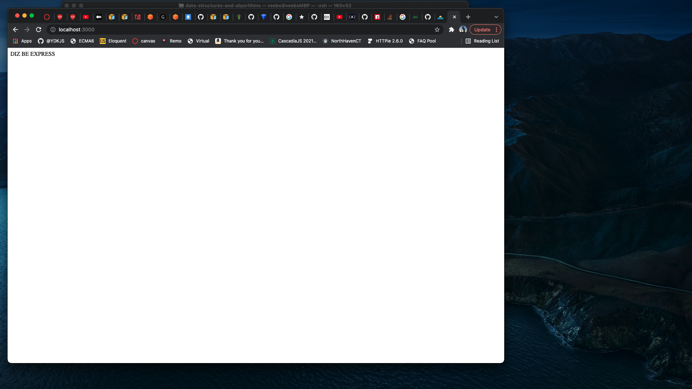

# simple-express-server-1239

Starts a simple express server with proof of life.

## Versions

1.0.0 - First Publish  
2.0.0 - Adding functionality  
2.1.0 - Working Module Functionality  
2.2.0 - Added README  
2.3.0 - Added class  
2.4.0 - Added post request route  
2.5.0 - Fixed bugs  

## Github Link

[simple-express-server-1239](https://github.com/Planet-NPM-Express/simple-express-server)

## Install

```
npm i simple-express-server-1239
```

## Usage

In our NPM package, after installing our package, you will have to `let <variableName> = require('simple-express-server-1239')`.

Calling that variable function with the parameters of your port number and Proof of life.

Example:

```
let expressServer = require('simple-express-server-1239');

expressServer(3000, 'My Proof of Life')
```

## Contributors

- Charlie Fadness, Software Developer
- Heather Bisgaard, Software Engineer
- Mark Thanadabouth, Software Developer

## Sources/References

[NPM Docs](https://docs.npmjs.com/getting-started)  
[How to Create and Publish your first NPM package](https://www.youtube.com/watch?v=J4b_T-qH3BY)  
[Publish issues](https://stackoverflow.com/questions/54950544/npm-publish-registry-403-forbidden-you-dont-have-permission-to-publish/55680824)  
[Tiny NPM Package](https://www.freecodecamp.org/news/how-to-make-a-beautiful-tiny-npm-package-and-publish-it-2881d4307f78/)  
[Express Starter](https://expressjs.com/en/starter/hello-world.html)

## Tools

npm.js  
express  
GitHub  

## Issues

Ran into error while trying to publish. It said we did not have permmission. Googling said this error was due to account verication emails. More googling revealed we had the same name for oour package as someone else from 6 years earlier.  

Lesson learned from this is to think of a name and verify on nmpjs.com before trying to publish.

## Proof of Life


